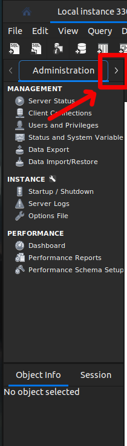

# Seção 21: Banco de dados Relacional:

## Aula 01 - Instalação MySQL Server & Workbench:

### Windows:
Em breve irei comprar um outro notebook, com OS Windows, então irei colocar os passos a passos aqui.

### MacOs:

### Linux - Ubuntu 22.04:
Como o meu sistema operacional que utilizo é o Linux Ubuntu 22.04, então, infelizmente, no curso do professor, Leonardo, não foi exibido a forma de configuração. Logo, tive que realizar isso por conta própria caçando fontes que possibilite a instalação do MySQL Server e Workbench.

Seguir os seguintes links para realizar a instalção:

    https://www.youtube.com/watch?v=Gw8_QOicyIQ&t=100s

    https://www.youtube.com/watch?v=Gw8_QOicyIQ

    https://stackoverflow.com/questions/17975120/access-denied-for-user-rootlocalhost-using-password-yes-no-privileges

    https://stackoverflow.com/questions/43094726/your-password-does-not-satisfy-the-current-policy-requirements

Com base disso, consegui realizar algumas manipulações.

#### Basicamente os passo a passo são o seguinte:
Atualize o índice de pacotes:

    sudo apt update

Instale o pacote do servidor MySQL:

    sudo apt install mysql-server

Execute o script de segurança do MySQL. Este script irá ajudar a melhorar a segurança do seu servidor MySQL:

    sudo mysql_secure_installation

No comando acima, vc irá definir uma senha. Lembrando, não coloque caracteres especiais. Claro que a senha precisa ser difícil, mas nada de caractere especiais.

Inicie e habilite o serviço do MySQL:

    sudo systemctl start mysql
    
Verifique o status do serviço do MySQL:

    sudo systemctl status mysql

Comando para iniciar o mysql pelo terminal:

    sudo mysql -u root -p

Provavelmente, o usuário está conseguindo acessar com senha simples ou, caso ela tenha escolhido STRONG = 2, então estará acessando sem a senha e será necessário definir uma da seguinte forma

    SELECT user,authentication_string,plugin,host FROM mysql.user;

Irá mostrar a tabela, onde será exibido algo como seguinte

        +------------------+-------------------------------------------+-----------------------+-----------+
    | user             | authentication_string                     | plugin                | host      |
    +------------------+-------------------------------------------+-----------------------+-----------+
    | root             |                                           | auth_socket           | localhost |
    | mysql.session    | *THISISNOTAVALIDPASSWORDTHATCANBEUSEDHERE | mysql_native_password | localhost |
    | mysql.sys        | *THISISNOTAVALIDPASSWORDTHATCANBEUSEDHERE | mysql_native_password | localhost |
    | debian-sys-maint | *497C3D7B50479A812B89CD12EC3EDA6C0CB686F0 | mysql_native_password | localhost |
    +------------------+-------------------------------------------+-----------------------+-----------+

Ou, como foi no meu caso, pois coloquei STRONG=2, o seguinte

        +------------------+------------------------------------------------------------------------+-----------------------+-----------+
    | user             | authentication_string                                                  | plugin                | host      |
    +------------------+------------------------------------------------------------------------+-----------------------+-----------+
    | debian-sys-maint | $A$005$SpJcZJG!]EmLyWQm7ravVnzsqMxam/KbO6vMqLAnj0mbfJaVe5S/6Xq. | caching_sha2_password | localhost |
    | mysql.infoschema | $A$005$THISISACOMBINATIONOFINVALIDSALTANDPASSWORDTHATMUSTNEVERBRBEUSED | caching_sha2_password | localhost |
    | mysql.session    | $A$005$THISISACOMBINATIONOFINVALIDSALTANDPASSWORDTHATMUSTNEVERBRBEUSED | caching_sha2_password | localhost |
    | mysql.sys        | $A$005$THISISACOMBINATIONOFINVALIDSALTANDPASSWORDTHATMUSTNEVERBRBEUSED | caching_sha2_password | localhost |
    | root             |                                                                        | auth_socket           | localhost |
    +------------------+------------------------------------------------------------------------+-----------------------+-----------+

Daí, será necessário realizar uma autenticação de uma string, da seguinte forma

    ALTER USER 'root'@'localhost' IDENTIFIED WITH plugin BY 'Current-Root-Password';

No "plugin" substituímos o que foi configurado na coluna plugin como, mysql_native_password ou caching_sha2_password.

Assim, no final, colocamos

    FLUSH PRIVILEGES;

Saimos do mysql:

    \q

Aí reiniciamos o mysql

    sudo systemctl restart mysql

Basicamente, o passo acima serve para conseguirmos configurar não só a senha para o usuário "root", como também, nos permite configurar as autenticações para conseguirmos acessar pelo WorkBench com o usuário root e a senha que definimos acima.

Vamos tentar acessar novamente

    sudo mysql -u root -p

Se colocarmos alguma senha qualquer e ele mostrar algum erro do tipo

    ERROR 1045 (28000): Access denied for user 'root'@'localhost' (using password: YES)

Então, significa que a senha foi autenticada com sucesso. Então, rodando novamente o comando para acessando o mysql server e colocando a senha, provavelmente, iremos conseguir acessar o mysql server pelo terminal.

Agora, vamos instalar o MySQL Workbench da seguinte forma. No meu caso, em Linux Ubuntu 22.04, eu simplesmente acessei o app, Ubuntu Software, e procurei pelo MySQL nela e instalei o Workbench.

Agora, ao clicarmos no ícone do Workbench, depois que instalado o Workbench, ela nos mostrará a seguinte tela

Onde estiver escrito "Local instance 3306" onde está configurado "roo" e a porta "3306" do localhost. Ao clicarmos, no momento, nesse ícone que dizemos, vamos ver que não conseguimos acessar o banco de dados. Bom, claro, vamos ter que configurar a senha para conseguirmos acessar essa base.

Para isso, iremos clicar no seguinte

Isso irá abrir a seguinte janela

Assim, clicamos no seguinte

Em "clear" e, em seguida, em "Store in Keychain" e isso irá abrir o seguinte

Na aba "Pawwsord" colocamos a senha que vc definiu no processo de configuração do MySQL Server, o que vc usou para conseguir acessar o server pelo shell, sudo mysql -u root -p. E em seguida, clicamos em Ok.

Voltando no modal

Clicamos em "Test Connection" como segue

Se aparecer a seguinte modal, significa que a conexão foi estabelecida com sucesso

Então, clicando no botão "Local instance 3306"

Irá aparecer a aplicação seguinte

No momento, vemos que não temos uma base de dados sendo exposto, a não ser a base "sys"

 
Vamos precisar criar uma nova seguindo o seguinte passo

Clicando no ícone acima, será direcionado para a seguinte janela

Daí, na aba "Schema Name" vamos colocar o nome "wm" e clicamos no botão "Apply" como seguinte

Isso irá mostrar o seguinte modal e continuamos clicando no botão "Apply" como seguinte

E nesse modal, clicamos em "close"

Assim, vemos que foi criado a base "wm" como seguinte

Bom, agora, estamos prontos para conseguirmos realizar as devidas manipulações dentro dessa base, que será abordado ao longo dessa seção.

Note que, as manipulações que eu realizar no MySQL Worbench, reflete nos dados que consigo consultar pelo terminal com mysql ativo.

Logo, o ambiente para conseguirmos estudar sobre banco de dados relacional está pronta.

## Aula 02 - Modelo E/R (Entidade(Tabela)/Relacionamento):
Bom, basicamente, explica a estrutura do que é um banco de dados relacional, que é uma matriz, donde para cada coluna, ela define um tipo de dados a ser computado nela.

Além disso, tais tabelas/matriz podem ser relacionados com outras tableas/matrizes, donde vc manipula dados.

## Aula 03 - Chave Primária:
As características principais de uma chave primária:

- única

- não vazia

- não muda

Ou seja, a chave primária é uma identidade única, como se fosse uma identidade que existe unicamente nesse mundo. Isso serve para conseguirmos estabelecer os relacionamentos, pois quando estivermos relacionando as tabelas, exatamente, é pela chave primária que estabelecemos o relacionamento entre tabelas. Ou seja, cada tabela tem um identificador único.

## Aula 04 - Relacionamentos:
Quando vamos relacionar duas tabelas, por via de uma chave primária, onde cada tabela possui, é feito como se fosse um cartesiano de dois conjuntos.

Exemplo:

- Tabela A = Coleciona o nome das mães

- Tabela B = Coleciona o nome dos filhos das mães acima

Logo, o relacionamento com essas duas tabelas, é dada via a chave primária que cada mãe possui unicamente, assim como cada filho possui unicamente.

Assim, temos que 

    Tabela A x Tabela B = { (x,y); x in Tabela A and y in Tabela B}

No caso, o relacionamento entre a Tablea A e Tabela B, seria um conjunto

    R = { (x,y) in Tabela A x Tabela B; x ~ y}

donde

    x ~ y <=> x é mãe de y (identificado um par de chave primária)

e R é subconjunto de Tabela A x Tabela B.

Bom, o relacionamento de uma tabela, poderia ser um simples Join, quando R = Tabela A x Tabela B ou quando R é subconjunto de Tabela A x Tabela B.

## Aula 05 - SQL - Visão geral:
SQL - Strutctural Query Language, possui quatro pilares:

- DML - Data Manipulation Language - é o mais usado (select, update, insert, delete, etc...)

- DDL - Data Definition Language - outra mais usada (create, alter, drop, etc...)

- DCL - Data Control Language - controla quem pode ou não acessar os dados, ou seja, controla a segurança dos banco de dados (grant, deny, revoke etc...)

- TCL - Transaction Control Language - muito usado para processos de transações de dinheiro entre banco/banco ou banco/cliente (begin trans, commit trans, rollback, etc...)

## Aula 06 - Criar Schema & Plugins VS Code:
Fala, pessoal!

Nessa seção do curso o Leo utilizará na maior parte a extensão vscode-database para se comunicar com o banco de dados MySQL. Após instalar a extensão, é necessário conectá-la ao banco de dados. Podemos fazer isto seguindo os seguintes passos:

1. Clique no botão Server not selected

2. Clique em New Connection

3. Selecione a caixa insecure auth e preencha o campo Password com a senha do seu banco de dados

4. Crie um arquivo com o nome criarSchema.sql, digite a linha create schema wm; e clique no ícone Run file as query para criar o schema que será utilizado nesta seção

5. Clique no botão Database not selected

6. selecione wm

Pronto, agora você pode acompanhar as aulas desta seção sempre executando as querys diretamente pelo VS Code, através do botão Run file as query.

Ou seja, qualquer query que irei realizar com os comandos SQL será refletidos nessa base, wm, que foi criado.

Bons estudos!

Pode-se usar o MySQL Workbench, também, para acompanhar o curso!

Guardarei todas as querys dentro da pasta, banco-relacional, desse curso.

Visto que os ambientes estão prontos, então estamos preparados para conseguir dar continudade no aprendizado desse curso!

## Aula 07 - Visão Geral do Modelo:
Vamos criar as tabelas Estados, Cidades, Prefeitos e Empresas e brincar com as relações entre eles.

Para cada comando

    Ctrl + Shift + e

Para executar e conseguir visualizar os comandos selecionados por parte.

## Aula 08 - Criar Tabela Estados:
Seguir o arquivo "criar-tabela-estado.sql".

## Aula 09 - Inserir Estados:
Seguir o arquivo "inserirEstado1.sql".

http://files.cod3r.com.br/curso-web/estados.sql

## Aula 10 - Consultar Estados:
Seguir o arquivo "consultarEstados.sql".

## Aula 11 - Atualizar Estados:
Seguir o arquivo "atualizarEstados.sql".

## Aula 12 - Inserir Estados com ID:
Seguir o arquivo "inserirNovosEstados.sql".

## Aula 13 - Excluir Estados:
Seguir o arquivo "excluirEstados.sql"

## Aula 14 - Consultar Estados com Agregação:
Seguir o arquivo "consultarComAgregacao.sql".

## Aula 15 - Criar Tabelas Cidades:
Seguir o arquivo "criarTabelasCidades.sql".

## Aula 16 - Inserir Cidades:
Seguir o arquivo "inserirCidades.sql".

## Aula 17 - Consultar Múltiplas Tabelas (JOIN):
Seguir o arquivo "consultarComJoin.sql".

## Aula 18 - Tipos de JOIN's:
Seguir o arquivo "osTiposDeJoins.sql"

## Aula 19 - Criar Tabela Prefeitos:
Seguir o arquivo "criarTabelaPrefeito.sql".

## Aula 20 - Inserir Prefeitos:
Seguir o arquivo "inserirPrefeitos.sql".

## Aula 21 - Explorando os Tipos de JOIN's:
Seguir o arquivo "osTiposDeJoins.sql". Faremos isso no Workbench, pois aqui pelo VSCode, teremos alguns problemas de plugins.

## Aula 22 - Criar Tabela Empresas:
Seguir o arquivo "criarTabelaEmpresas.sql"

## Aula 23 - Inserir Empresas:
Seguir o arquivo "inserirEmpresas.sql".

## Aula 24 - Consultar Empresas e Cidades:
Seguir o arquivo "consultarEmpresas.sql". Realizemos essa consulta pelo Workbench, visto que em VSCode está tendo algum problema de plugins.
